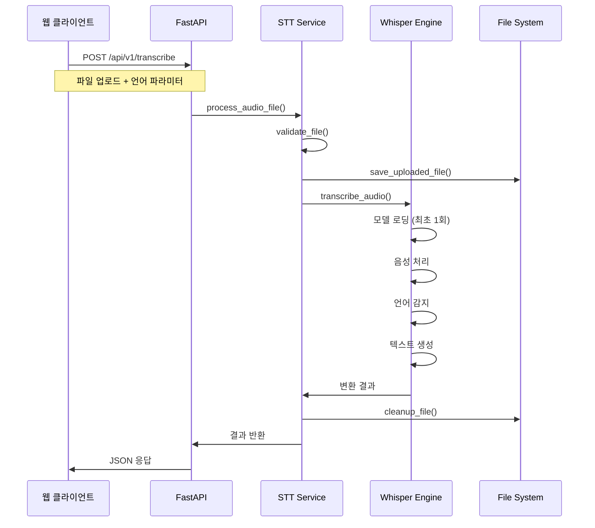
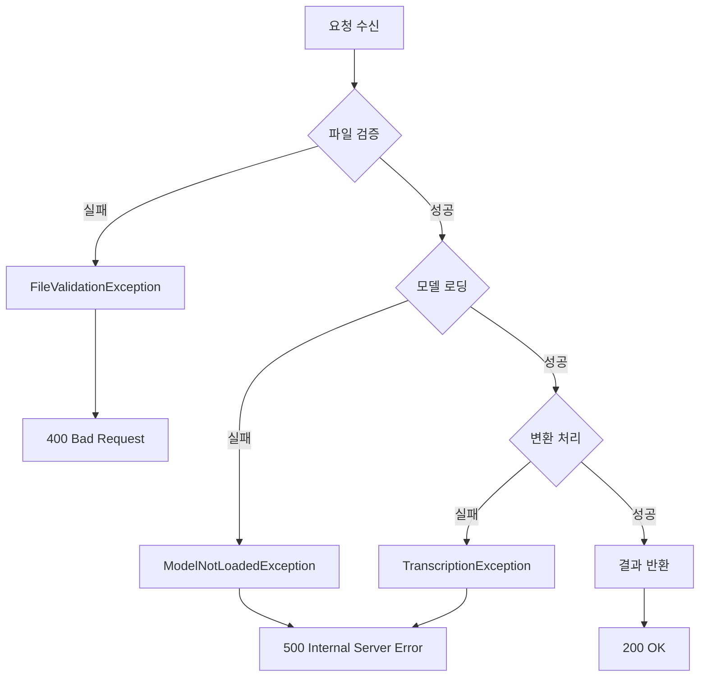

# 시스템 아키텍처

STT Server의 전체 시스템 아키텍처와 설계 원칙을 설명합니다.

## 전체 아키텍처

```
┌─────────────────┐    ┌─────────────────┐    ┌─────────────────┐
│   Web Client    │    │   API Client    │    │   Mobile App    │
│   (Port 3000)   │    │   (Any Client)  │    │   (iOS/Android) │
└─────────┬───────┘    └─────────┬───────┘    └─────────┬───────┘
          │                       │                       │
          └───────────────────────┼───────────────────────┘
                                  │
                    ┌─────────────▼─────────────┐
                    │      FastAPI Server       │
                    │      (Port 7920)         │
                    └─────────────┬─────────────┘
                                  │
                    ┌─────────────▼─────────────┐
                    │      API Layer            │
                    │  ┌─────────────────────┐  │
                    │  │   Routes            │  │
                    │  │   - /api/v1/health  │  │
                    │  │   - /api/v1/transcribe│  │
                    │  │   - /api/v1/info    │  │
                    │  └─────────────────────┘  │
                    └─────────────┬─────────────┘
                                  │
                    ┌─────────────▼─────────────┐
                    │      Service Layer        │
                    │  ┌─────────────────────┐  │
                    │  │   STT Service       │  │
                    │  │   - Model Loading   │  │
                    │  │   - File Processing │  │
                    │  │   - Transcription   │  │
                    │  └─────────────────────┘  │
                    └─────────────┬─────────────┘
                                  │
                    ┌─────────────▼─────────────┐
                    │      Whisper Engine       │
                    │  ┌─────────────────────┐  │
                    │  │   Faster Whisper    │  │
                    │  │   - Audio Processing│  │
                    │  │   - Language Detection│  │
                    │  │   - Text Generation │  │
                    │  └─────────────────────┘  │
                    └─────────────┬─────────────┘
                                  │
                    ┌─────────────▼─────────────┐
                    │      File System          │
                    │  ┌─────────────────────┐  │
                    │  │   Uploads Directory │  │
                    │  │   - Temporary Files │  │
                    │  │   - Cleanup Process │  │
                    │  └─────────────────────┘  │
                    └────────────────────────────┘
```

## 레이어별 구조

### 1. 프레젠테이션 레이어 (Presentation Layer)

#### 웹 클라이언트 (`client/`)
```
client/
├── templates/
│   └── index.html          # 메인 UI
├── web_client.py           # HTTP 서버
├── run_web.py             # 실행 스크립트
└── requirements.txt        # 클라이언트 의존성
```

**주요 기능:**
- 마이크 녹음 기능
- 파일 업로드
- 실시간 결과 표시
- 언어 선택 드롭다운

### 2. API 레이어 (API Layer)

#### 라우터 (`src/api/`)
```
src/api/
├── __init__.py
└── routes.py              # API 엔드포인트 정의
```

**엔드포인트:**
- `GET /api/v1/health` - 서버 상태 확인
- `POST /api/v1/transcribe` - 음성 변환
- `GET /api/v1/info` - 서비스 정보

### 3. 서비스 레이어 (Service Layer)

#### STT 서비스 (`src/services/`)
```
src/services/
├── __init__.py
└── stt_service.py         # 핵심 비즈니스 로직
```

**주요 기능:**
- Whisper 모델 로딩
- 파일 검증 및 처리
- 음성-텍스트 변환
- 파일 정리

### 4. 모델 레이어 (Model Layer)

#### DTO 모델 (`src/models/`)
```
src/models/
├── __init__.py
├── dto.py                 # 중앙 DTO 임포트
├── requests.py            # 요청 DTO
└── responses.py           # 응답 DTO
```

**DTO 구조:**
- `TranscribeRequest` - 음성 변환 요청
- `TranscriptionResponse` - 변환 결과
- `HealthResponse` - 서버 상태
- `ServiceInfoResponse` - 서비스 정보

### 5. 설정 레이어 (Configuration Layer)

#### 설정 관리 (`src/core/`)
```
src/core/
├── __init__.py
├── app.py                 # FastAPI 앱 팩토리
└── config.py              # 설정 관리
```

**설정 항목:**
- 서버 설정 (호스트, 포트)
- Whisper 설정 (모델, 디바이스, 언어)
- 파일 업로드 설정
- CORS 설정

### 6. 유틸리티 레이어 (Utility Layer)

#### 유틸리티 (`src/utils/`)
```
src/utils/
├── __init__.py
├── logger.py              # 로깅 설정
├── exceptions.py          # 커스텀 예외
├── error_messages.py      # 에러 메시지
├── log_messages.py        # 로그 메시지
└── exception_handlers.py  # 예외 처리
```

## 데이터 플로우

### 1. 음성 변환 프로세스



### 2. 에러 처리 플로우



## 기술 스택

### 백엔드
- **FastAPI**: 현대적인 Python 웹 프레임워크
- **Uvicorn**: ASGI 서버
- **Pydantic**: 데이터 검증 및 설정 관리
- **Faster Whisper**: 음성-텍스트 변환 엔진

### 프론트엔드
- **HTML5**: 웹 클라이언트 구조
- **CSS3**: 스타일링
- **JavaScript**: 클라이언트 로직
- **MediaRecorder API**: 실시간 녹음

### 인프라
- **Docker**: 컨테이너화
- **Docker Compose**: 멀티 컨테이너 오케스트레이션
- **FFmpeg**: 오디오 처리

## 설계 원칙

### 1. 관심사 분리 (Separation of Concerns)
- **API 레이어**: HTTP 요청/응답 처리
- **서비스 레이어**: 비즈니스 로직
- **모델 레이어**: 데이터 구조 정의
- **유틸리티 레이어**: 공통 기능

### 2. 의존성 주입 (Dependency Injection)
```python
# 전역 서비스 인스턴스
stt_service = STTService()

# 라우터에서 사용
@router.post("/transcribe")
async def transcribe_audio(file: UploadFile):
    return await stt_service.process_audio_file(file)
```

### 3. 예외 처리 (Exception Handling)
```python
# 커스텀 예외 클래스
class FileValidationException(Exception):
    pass

# 전역 예외 핸들러
@app.exception_handler(FileValidationException)
async def file_validation_exception_handler(request, exc):
    return JSONResponse(
        status_code=400,
        content={"error": str(exc)}
    )
```

### 4. 설정 관리 (Configuration Management)
```python
# Pydantic 기반 설정
class Settings(BaseSettings):
    HOST: str = "0.0.0.0"
    PORT: int = 7920
    WHISPER_MODEL: str = "base"
    
    class Config:
        env_file = ".env"
```

## 성능 고려사항

### 1. 비동기 처리
- **FastAPI**: 비동기 웹 프레임워크
- **파일 처리**: 비동기 I/O
- **모델 로딩**: 싱글톤 패턴

### 2. 메모리 관리
- **임시 파일**: 자동 정리
- **모델 캐싱**: 한 번 로딩 후 재사용
- **스트리밍**: 대용량 파일 처리

### 3. 확장성
- **마이크로서비스**: 독립적인 서비스 구조
- **컨테이너화**: Docker 기반 배포
- **로드 밸런싱**: 다중 인스턴스 지원

## 보안 고려사항

### 1. 입력 검증
- **파일 형식**: 허용된 확장자만
- **파일 크기**: 최대 크기 제한
- **언어 파라미터**: 유효한 언어 코드만

### 2. CORS 설정
```python
app.add_middleware(
    CORSMiddleware,
    allow_origins=["*"],
    allow_credentials=True,
    allow_methods=["*"],
    allow_headers=["*"],
)
```

### 3. 에러 정보 노출 제한
- **프로덕션**: 상세 에러 정보 숨김
- **개발**: 디버그 정보 제공

## 모니터링 및 로깅

### 1. 구조화된 로깅
```python
logger.info(get_log_message("API", "REQUEST_RECEIVED", filename=file.filename))
```

### 2. 성능 메트릭
- **처리 시간**: 각 요청별 처리 시간
- **파일 정보**: 업로드된 파일 크기 및 형식
- **언어 감지**: 감지된 언어 및 확률

### 3. 헬스 체크
- **서버 상태**: 기본 서버 상태
- **모델 상태**: Whisper 모델 로딩 상태
- **서비스 정보**: 상세 서비스 정보

## 향후 개선 사항

### 1. 기능 확장
- **실시간 스트리밍**: WebSocket 기반 실시간 변환
- **배치 처리**: 다중 파일 동시 처리
- **사용자 관리**: 인증 및 권한 관리

### 2. 성능 최적화
- **GPU 가속**: CUDA 지원 확대
- **캐싱**: Redis 기반 결과 캐싱
- **CDN**: 정적 파일 배포

### 3. 모니터링 강화
- **메트릭 수집**: Prometheus 기반
- **로그 집중화**: ELK 스택
- **알림 시스템**: Slack/이메일 알림 